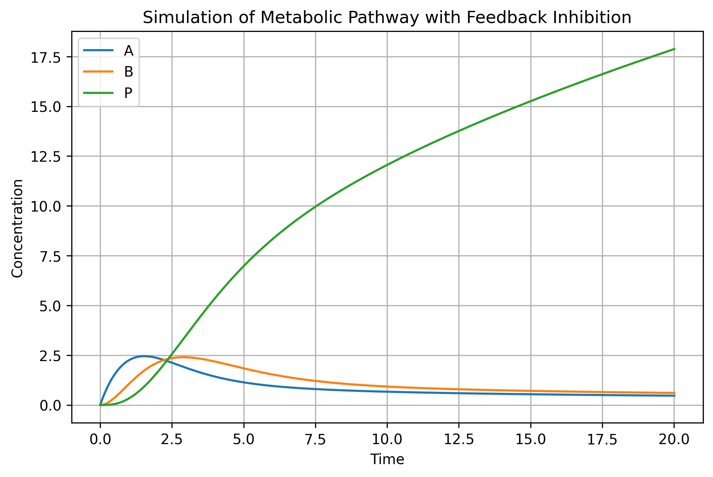

# Q2C – Kinetic Model Simulation

This repository contains a simple kinetic model simulation for a metabolic pathway with feedback inhibition.

## Reaction Network

```text
X → A → B → P
    ↓
 Byproduct
```

In this model, product **P** inhibits the first reaction (**v1**) through non-competitive feedback inhibition.

## Model Description

The fluxes used in the model are:

```text
v1 = (Vmax × X) / ((Km + X) × (1 + P / Ki))
v2 = k2 × A
v3 = k3 × B
v4 = k4 × A
```

The ordinary differential equations (ODEs) are:

```text
dA/dt = v1 - v2 - v4
dB/dt = v2 - v3
dP/dt = v3
```

## Parameters

| Parameter | Meaning | Value |
|---|---|---:|
| Vmax | Maximum rate of v1 | 5.0 |
| Km | Michaelis constant for v1 | 2.0 |
| Ki | Inhibition constant | 3.0 |
| X | External substrate concentration | 10 |
| k2 | Rate constant for A → B | 1.0 |
| k3 | Rate constant for B → P | 0.8 |
| k4 | Rate constant for A → byproduct | 0.3 |

## Simulation Result

The simulation shows that A and B initially increase because the upstream reaction rate is high when product concentration is still low. As product P accumulates, it inhibits reaction v1, which reduces the formation of A. Therefore, A and B gradually decrease, while P continues to accumulate as the final product.


